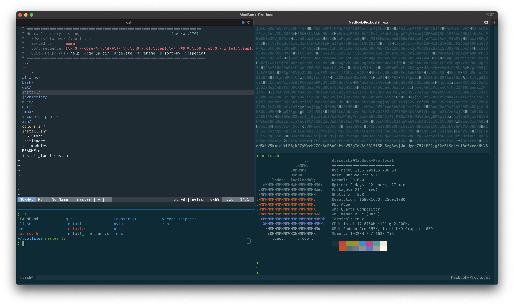

# .dotfiles

This is refactored and upgraded version of my [old dotfiles](https://github.com/Puritanic/.dotfiles) (hopefuly the last refactor 😅), based on [Phantas0s's dotfiles](https://github.com/Phantas0s/.dotfiles). The new improved dotfiles are much simpler to use than the old ones, since the installation process is much more streamlined and configurable. This is a set of config files and tools I'm using (almost) everyday. Feel free to fork/clone this repo but take care that many of this configs are tailored to my own taste, and are using my directory structure.

Features:

-   `Neovim` - as terminal editor
-   `Tmux` - as terminal multiplexer
-   `zsh` - as shell
-   `Powerlevel10k`/`starship` - as zsh prompt
-   `n` - as node version manager
-   `jenv` - as Java version manager
-   custom git configuration
-   a bunch of useful aliases
-   a bunch of useful scripts
-   Fedora/OSX combo

Stuff I'm planning on adding and improving in the future:

-   `tmuxp` as tmux session manager
-   further `tmux` improvements
-   `neovim` configuration improvements and fixes (some stuff is not working great)
-   improve font installation
-   improve ssh and gnupg migration process

## Installation

Just run `install.sh` and follow the installation process, you'll need to enter your sudo password in order to install some packages.

> Note: Installation is a pretty verbose, as I've wanted each step logged to terminal. You can clean output a bit bu removing verbose flag from creating symlinks if you wish.
